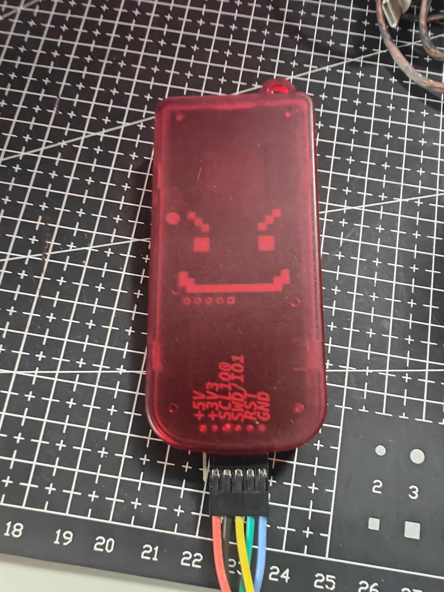

<!-- English -->
<!--
 * @Author: Entropy Disorder
 * @Date: 2025-12-11 22:22:40
 * @LastEditors: 无序熵增
 * @LastEditTime: 2025-12-18 18:49:16
 * @Description:
 *
 * Copyright (c) 2025 by Entropy Disorder, All Rights Reserved.
-->
# Hacker Console Firmware Source Code

## 📋 Project Overview
**Hacker Console** is a handheld terminal designed by myself, based on the **Raspberry Pi B** series as the mainboard.  
If you are interested in my design, please search for **“Hacker Console”** on **Bilibili**.

As a highly expandable handheld terminal, it features:

- 🖥️ **Driver-free HDMI display** with touch support
- ⌨️ **HID protocol keyboard**, USB-based, plug-and-play
- 🔧 **Independent PCB design**, replaceable keyboard
- 📊 **Secondary status display**, real-time system monitoring
- 🔌 **Exposed GPIO headers** for peripheral expansion
- 🏗️ **Open-source enclosure design**, supports customization

## 🔧 Firmware Description
This repository provides the programs running on the main control board, including firmware for two microcontrollers.

### ⌨️ Keyboard Module Firmware
There are both new and old keyboard versions. Please select the corresponding firmware according to the keyboard version you have.  
(In general, keyboards are shipped with firmware already flashed.)

| Keyboard Version | Corresponding Directory |
|------------------|-------------------------|
| **New Keyboard** | `newkeyboard3` folder |
| **Old Keyboard** | `keyboard2` folder |

### 🖥️ Mainboard Firmware
The mainboard firmware is located in the `mainboard5` folder.

## 🛠️ Build Guide

### 📦 Environment Requirements
- **Arduino IDE**
- **RP2040 board package**
- **Be sure to install version 4.4** of the RP2040 package

<em>Note: Version 4.4 of the board package must be selected</em>

### ⚙️ Build Configuration
1. **Boot Stage 2** → Select **Generic SPI/4**
2. **USB Stack** → Set to **"PICO SDK"**

<em>Correct build configuration screen</em>

### 📝 Build Steps
1. Open Arduino IDE and load the project
2. Use the shortcut **`Ctrl + Alt + S`** to compile
3. The firmware will be automatically exported to the project directory
4. The output file will be in **`.uf2`** format

<table>
<tr>
<td align="center"> Compilation Process</td>
<td align="center"> Generated UF2 File</td>
</tr>
</table>

## 🔄 Flashing Guide

### ⌨️ Keyboard Firmware Flashing
> **Note**: The keyboard firmware must be flashed **separately using a programmer**.
>
> If you are capable of modifying the code, **picoprobe** is recommended for flashing.
> Alternatively, you may use another open-source project of mine: **rp2040-rp2350-debugger**.
> This is a programmer specifically designed for official Raspberry Pi ICs and is compatible with Pickit enclosures.
> Repository: https://github.com/Chaoschaos1024/rp2040-rp2350-debugger

<table>
<tr>
<td align="center"> Programmer Front</td>
<td align="center"> Programmer Back</td>
</tr>
</table>

### 🖥️ Mainboard Firmware Upgrade
#### Steps:
1. Locate the two small holes on the left side of the device (each contains a button)
2. **Press and hold the upper button**
3. **Press the lower button once**
4. Wait for the system to recognize a USB mass storage device

<em>Location of the flash mode buttons on the left side</em>

#### Firmware Update:
5. The Raspberry Pi system will detect a **USB drive**
6. Drag and drop the compiled **`.uf2`** firmware file into the drive
7. The device will automatically complete the firmware upgrade

<em>Drag the UF2 file into the USB drive to complete the update</em>

## 🤝 Contributions and Feedback
**You are welcome to:**
- ✏️ Modify the code and submit Pull Requests
- 💡 Share new ideas and improvement suggestions
- 👥 Join the discussion group: **867028792** to get in touch

Thank you for your interest and support!

## 📄 License

This project is licensed under the **MIT License** – see the [LICENSE](LICENSE) file for details.

---

Made with ❤️ for the Hacker Console community

